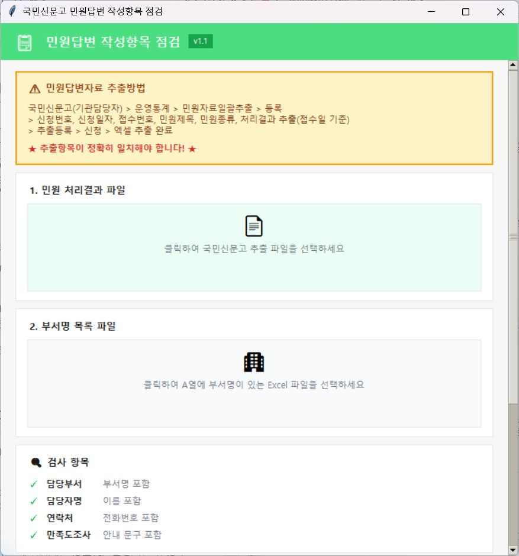

# 국민신문고 민원답변 작성항목 점검 도구

국민신문고에서 추출한 민원 처리결과 자료를 대상으로 답변문에 들어가야 할
작성항목의 누락 여부를 일괄 점검하는 내부 관리용 도구입니다. 파일을
선택해 실행하는 GUI와 설정값을 직접 지정하는 CLI 스크립트를 제공합니다.

## 제작 배경과 목적

민원서비스 종합평가 지표에 대응하려면 민원답변을 발송할 때 담당부서,
담당자, 연락처와 만족도 조사 안내 등 필요한 작성항목을 갖추어야 합니다.
하지만 민원 건수가 많으면 민원총괄담당자가 답변문을 한 건씩 열어 확인하기
어렵습니다.

이 도구는 민원총괄담당자가 국민신문고에서 처리결과 자료를 내려받아
답변 작성항목의 누락 가능성을 한 번에 선별하고, 부서별 보완 대상을
관리할 수 있도록 만든 점검 보조도구입니다.

> 이 도구의 결과는 내부 관리용 1차 점검 자료입니다. 정규식과 부서명
> 목록을 이용해 누락 가능성을 찾기 때문에, 최종 판단과 보완 요청 전에는
> 담당자가 실제 답변문을 확인해야 합니다.

## 검사 항목

### 1. 답변양식 준수 검사
민원답변(처리결과)에서 아래 3가지 필수 항목의 누락 여부를 검사합니다:
- **담당부서**: 부서명 목록 엑셀에서 매칭
- **담당자**: 이름 패턴 추출 (2~4글자 한글 + 직급)
- **연락처**: 전화번호 패턴 추출

### 2. 만족도 조사 안내 여부
민원답변에 만족도 조사 참여 안내 문구가 포함되어 있는지 검사합니다.

## 전체 이용 절차

1. 국민신문고에서 점검 대상 기간과 조건을 지정해 민원 처리결과 파일의
   추출을 신청합니다.
2. 추출이 완료되면 결과 파일을 Excel 형식(`.xlsx`)으로 내려받습니다.
3. 기관에서 사용하는 부서명 목록을 A열에 정리한 Excel 파일을 준비합니다.
4. GUI를 실행하고 처리결과 파일과 부서명 목록 파일을 각각 선택합니다.
5. `검사 시작`을 눌러 생성된 누락검사 결과 파일을 확인합니다.
6. CLI를 이용할 때만 스크립트 상단의 `INPUT_FILE`과 `DEPT_FILE`을 실제
   파일명에 맞게 수정합니다.
7. `전체목록` 시트에서 누락 가능성이 표시된 답변을 검토하고,
   `월별통계` 시트에서 부서별 미준수 현황을 관리합니다.

국민신문고의 메뉴 명칭과 추출 가능한 항목은 사용자 권한이나 시스템
개편에 따라 달라질 수 있습니다. 추출 파일에는 최소한 스크립트가
검사할 `처리결과` 열이 포함되어야 합니다.

## 실행 방법

### 필요 파일

1. `민원 처리결과 답변.xlsx` - 검사할 민원 처리결과 파일
2. `부서명 목록.xlsx` - 부서명 목록 파일 (A열: 부서명)

### 설치

```bash
pip install -r requirements.txt
```

### GUI 실행

```bash
python 민원답변_누락검사_GUI.py
```

처리결과 파일과 부서명 목록 파일을 차례로 선택한 뒤 `검사 시작`을
누릅니다. 결과 파일은 선택한 처리결과 파일과 같은 위치의 `outputs`
폴더에 저장됩니다.



### CLI 실행

```bash
python 민원답변_누락검사.py
```

스크립트 상단의 설정 부분을 수정하면 됩니다:

```python
INPUT_FILE = r'민원 처리결과 답변.xlsx'  # 검사할 파일
DEPT_FILE = r'부서명 목록.xlsx'          # 부서명 목록 파일
VERSION = 'v3'                                      # 버전
RESULT_COL = 6                                      # 처리결과 열 (F열)
```

## 출력 결과

### 출력 파일명
`{원본파일명}_누락검사_{타임스탬프}_{버전}.xlsx`

예: `민원 처리결과 답변_누락검사_20260211_160000_v3.xlsx`

### 시트 구성

#### 1. 전체목록 시트

| 열 | 내용 |
|---|---|
| A~F | 원본 데이터 (신청번호, 신청일자, 접수번호, 민원제목, 민원종류, 처리결과) |
| G | 누락항목 (없음 / 담당부서, 담당자, 연락처) |
| H | 부서 (추출된 부서명) |
| I | 담당자 (추출된 담당자명) |
| J | 연락처 (추출된 전화번호) |
| K | 만족도조사안내 (O/X) |

**색상 표시:**

- 노란색: 1개 누락
- 주황색: 2개 누락
- 빨간색: 3개 누락

#### 2. 월별통계 시트

- 전체 민원답변 수
- 답변양식 준수 현황 (준수/미준수 건수 및 비율)
- 만족도 조사 안내 현황 (O/X 건수 및 비율)
- 답변양식 미준수 목록 (팀별 그룹화, 건수 내림차순)

### 실행 결과 예시

아래는 실제 민원자료가 아닌 가상 10건을 검사했다고 가정한 예시입니다.

| 구분 | 건수 | 비율 |
|---|---:|---:|
| 전체 민원답변 수 | 10 | 100.0% |
| 양식 준수 | 4 | 40.0% |
| 양식 미준수 | 6 | 60.0% |
| 1개 누락 | 3 | 30.0% |
| 2개 누락 | 2 | 20.0% |
| 3개 누락 | 1 | 10.0% |
| 만족도 조사 안내 O | 7 | 70.0% |
| 만족도 조사 안내 X | 3 | 30.0% |

`전체목록` 시트에는 원본 열 오른쪽으로 점검 결과가 추가됩니다.

| 누락항목 | 부서 | 담당자 | 연락처 | 만족도조사안내 |
|---|---|---|---|---|
| 없음 | 부서A | 담당자명 | 0XX-XXXX-XXXX | O |
| 담당자 | 부서B |  | 0XX-XXXX-XXXX | X |
| 담당부서, 연락처 |  | 담당자명 |  | O |

> 위 표의 기관명, 담당자명, 전화번호 및 집계값은 설명을 위한 가상
> 데이터입니다.

## 저장소 구성

- `민원답변_누락검사_GUI.py`: 파일 선택 방식의 GUI 실행 파일
- `민원답변_누락검사.py`: 설정값을 직접 지정하는 CLI 실행 파일
- `requirements.txt`: Python 패키지 의존성
- `assets/gui-main.png`: 개인정보가 없는 GUI 실행 화면 예시

## 패턴 설명

### 담당자 이름 추출 패턴

- `OOO 주무관/사무관/계장/팀장/과장`
- `OO팀 OOO(전화번호)`
- `OO과 OOO(전화번호)`
- `담당자:OOO` 또는 `담당:OOO`
- `(전화번호, OOO)`

### 전화번호 추출 패턴

- `☎0XX-XXXX-XXXX` (기본 형식)
- `☎0XX-XXXX-XXXX,XXXX` (복수 내선번호)
- `(XXX-XXXX)` (지역번호 없는 형식)

### 만족도 조사 안내 패턴

- `만족도조사를 실시`
- `만족도 조사를 실시`
- `만족도조사에 참여`
- `만족도 조사에 참여`

## 요구사항

- Python 3.x
- openpyxl 라이브러리
- 국민신문고에서 추출한 민원 처리결과 Excel 파일
- 기관 부서명 목록 Excel 파일

## 개인정보 취급 주의

국민신문고 추출 자료에는 민원인의 개인정보와 민원 내용이 포함될 수
있습니다. 원본 및 결과 파일은 기관의 개인정보 보호·보안 기준에 따라
취급하고, Git 저장소에는 업로드하지 마십시오. 이 저장소에는 실행
스크립트와 설명 문서만 관리하는 것을 권장합니다.

## 버전 이력

- **GUI v1.1** (공개용 정리)
  - 기존 사용자 로컬 GUI 복원
  - 기관별 부서명을 코드에 내장하지 않고 Excel 파일로 선택하도록 변경
  - 공개용 GUI 화면 및 가상 실행 결과 예시 추가
- **v3** (2026.02.11)
  - H~K열 분리 (부서, 담당자, 연락처, 만족도조사안내)
  - 만족도 조사 안내 여부 검사 추가
  - 미준수 목록 팀 단위 그룹화
  - 파일명에 버전 표시 추가
